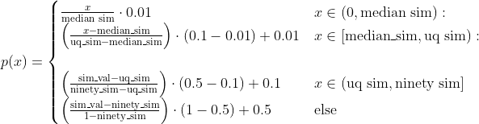
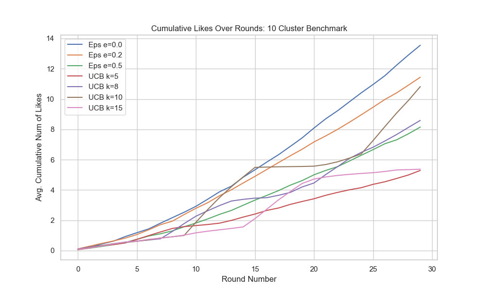
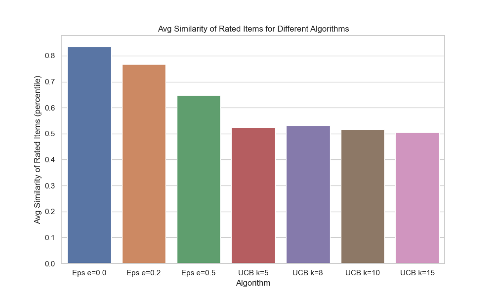
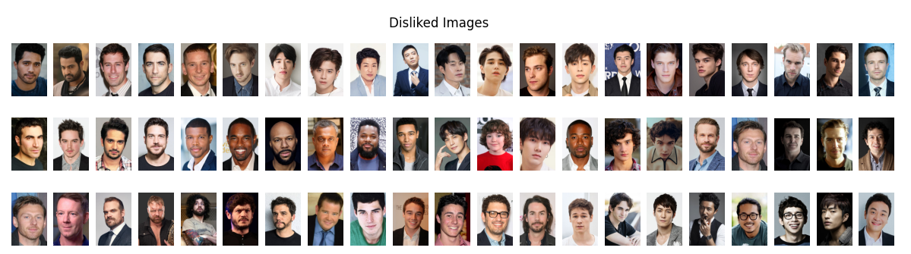
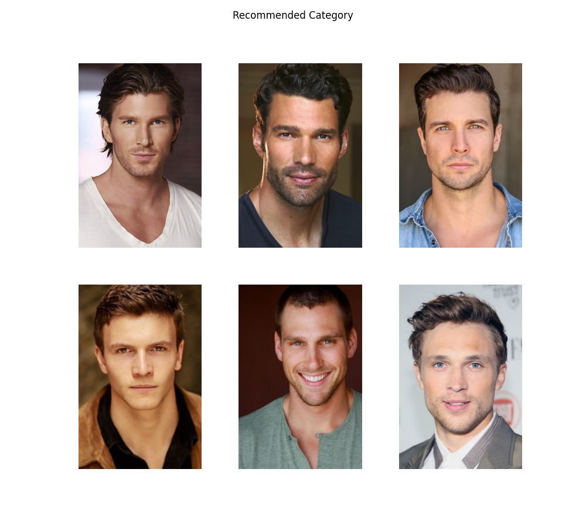
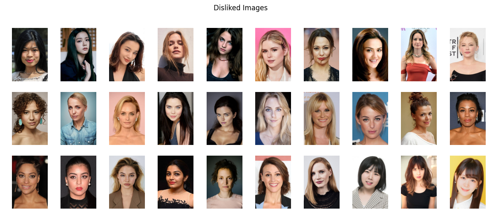

# Content Based E-Dating Recommender System 
Live Demo: 🚀 https://dating-recsys.web.app/
## Motivation 
This project was inspired by Tinder's matching algorithm TinVec (MLConf 2017), which required access to a dataset of swipes across users to generate profile embeddings. 
This motivated the following question: *without this data assumption, how would one recommend a profile while dealing with the cold-start problem?* 
This project utilizes solely image profile information (where images are embedded into a vector space) to recommend a cluster of people (i.e a certain category) to the user. 
To effectively explore and get feedback from the user, it uses unsupervised clustering (k-means) to generate broad strokes categories and then utilizes UCB to determine which categories would be more beneficial to get feedback from the user from both an exploration and exploitiation perspective.   

To generate the suggested category, it uses the rated subset of embeddings to construct a rating for all embeddings and then returns a clique of similar images that best represent the user's preferences.  

### Dataset
The profile images come from the TMDB, the Movie Database, which contain profile pictures of various actors and celebrities. The current dataset is little less than 5000 images of actors in the age range 20-40. 

## Method

### Embedding and Clustering 
In order to work with the image data, it uses MTCNN to extract the facial region which is inputted to VGG-Face, a pre-trained CNN trained specifically on faces, to get a vector embedding.
The vectors are then grouped into $k=10$ clusters using k-means.

The image embedding is particularly crucial- on a smaller dataset of CFD, using the OpenCV facial region detector in conjuction Facenet led to incoherent clusters, where dissimilar faces, including different sexes, where clustered together. 
We note that the current embeddings from VGG-Face often lead to clusters which group images by similar races or racial features. A embedding generated by facial landmarks might facilitate more racial-agnostic recommendations. 

### Efficient exploration for cold-start 
The main constraint is that for $5000$ images, the user only provides like or dislike ratings for a very select $30$ images. Given the need to explore and present all possible categories while also getting info on which categories might have a higher preference rating, we use the UCB algorithm. For the first $10$ rounds we pull each "arm" once, drawing an unseen image randomly from the cluster- for the remaining rounds, we greedily choose the arm with the maximal UCB score, which is calculated as $\mu_i  + \sqrt{\frac{log(t)}{n_{i}}}$ where the reward of each cluster is the proportion of liked images, i.e $\mu_i \in [0,1]$. 

### Value function for embeddings
In order to generate a highly rated cluster of images, there needs to be some value function assigning ratings to the images. 
The intuition is that liked images have a large rating whereas disliked images have a small rating. Moreover, image embeddings that are closer or more similar to the liked image embeddings and more further from/dissimilar to the disliked images should have a higher rating than those with the converse. 
To have the value function in line with this intuition, given a set of rated images $S$, where $val(s_i) = 1$ if liked and $val(s_i) = 0$ if disliked, the value of an embedding $val(v) = \sum_{s_i \in S} val(s_i) sim(s_i, v)$ where $sim$ is cosine similarity.

### Generating a recommended category
Here we generate a category of $n=6$ images. One might posit that the optimization problem is maximizing the sum of values in a n-size subset such that the pairwise similarity of each vector in the subset is larger than some threshold $T$. This can be equivalently expressed as a maximum weighted clique problem, which is NP Hard.
However, an approximate solution can be determined in a computationally efficient manner: points close to the maximal value image, due to the spatial construction of the value function, should also have a very high value. Thus, to determine a cluster of high sum value, it is enough to build a cluster of points around a high value point (either the maximum or the next largest value embeddings).

## Evaluation
We run experiments for hyper-parameter tuning. We also compare exploration methods (UCB, Epsilon Greedy, MinSim) in terms of efficacy in recommending liked items and moreover in their diversity of recommendations. 
### Synthetic Data
In order to create benchmark data, we utilize the following synthetic data generation methods. 

#### Stochastic Clusters
Each user profile has $c$ number of liked clusters, where $c$ is drawn from a probability distribution. For example, a user with one "ideal" category would be represented by $c=1$. 
Then, the method randomly samples $c$ items to generate $c$ "centers". The rating of all points are distributed as $Bernoulli(p(x))$ where $x$ is the cosine similarity to the nearest center and $p(x)$
is a piecewise linear function. 

  
#### Deterministic Clusters 
Each user profile has $c$ number of liked clusters, where $c$ is drawn from a probability distribution.
Then, the uses k-means to partition the data into $k$ blocks. Then, $c$ blocks are randomly sample to represent the user's liked groups and all items in those blocks have a rating of 1 and all other items have a rating of 0. 

### Baselines and Experiments
#### Epsilon Greedy 
We consider the classic epsilon greedy algorithm. $\epsilon$ percent of times a random image is chosen and $1-\epsilon$ times the image closest to a previously liked image is chosen. 

#### MaxSim
MaxSim solves a dual objective optimization where diversity of recommended images is directly part of the objective function. In particular the algorithm picks the image 
$ \argmax_x val(x) - \gamma maxSim(x)$ 
where $x$ is an item and $maxSim(x)$ is the max cosine similarity to any previously rated image. 

#### Experiments
Here we consider a benchmark of 100 synthethic users generated using the determinstic cluster method, where the number of clusters is one $c=1$. The benchmark has $k=10$ blocks as the partition size.

## Demonstrations
Here is an example of the algorithm in practice. 
For an example theme of *Wolverine Superhero*, here are the user liked, user disliked, and the generated category recommendation images.

For an example theme of *Cosmopolitan Korea*, here are the user liked and disliked images and the generated category recommendation.

